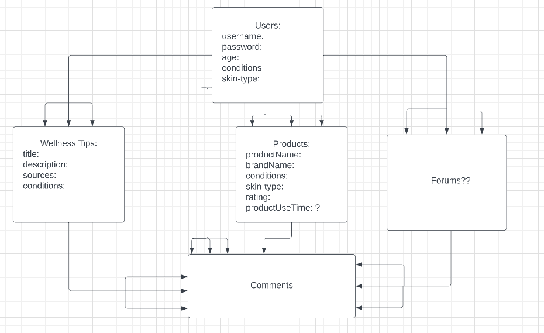

# Project-2: The doWell App

# Overview

The doWell app is a wellness sharing app where users can sign up and make profiles to share their favorite wellness tips and products. This fullstack app will be made using a the MVC (Model, View, Controller) model. For more details, check out the rest of this repo.

# Check out the Web App

-link will be here upon deployment

# User Stories

Users should be able to:

- Greeted by a home page
- Sign up to create an account (upon clicking sign up)
- Log in after entering the website (upon clicking log in)
- View their collection of wellness tips/products after clicking (upon clicking 'My Collection')
- Be able to create their own wellness tips from their 'My Collection' page
- Be able to delete AND edit their own wellness tips from their 'My Collection' page
- See what tips other people are posting (in order of the most recent) by clicking on 'Wellness Feed'
- Create comments under wellness tips
- Delete their own comments at any time
- Users can still look at tips without signing up/logging in. Howvever they will not be able to make comments.

# Wireframes

- Home Page

  

- Sign Up Page

  

- Log In Page

  

- MyCollections page

  

- Create a Tip/Product

  

- Wellness Feed

  

# Entity Relationship Diagrams (ERDs)

# Website Route Charts for Documents

#### Products

| **URL**          | **HTTP Verb** | **Action** |
| ---------------- | ------------- | ---------- |
| /products        | GET           | index      |
| /:productId      | GET           | show       |
| /new             | GET           | new        |
| /                | POST          | create     |
| /:productId/edit | GET           | edit       |
| /:productId      | PATCH/PUT     | update     |
| /:productId      | DELETE        | destroy    |

#### Wellness Tips

| **URL**               | **HTTP Verb** | **Action** |
| --------------------- | ------------- | ---------- |
| /wellnessTips/        | GET           | index      |
| /wellnessTips/:id     | GET           | show       |
| /wellnessTips/new     | GET           | new        |
| /wellnessTips         | POST          | create     |
| wellnessTips/:id/edit | GET           | edit       |
| wellnessTips/:id      | PATCH/PUT     | update     |
| wellnessTips/:id      | DELETE        | destroy    |

#### Collections

| **URL** | **HTTP Verb** | **Action**               |
| ------- | ------------- | ------------------------ |
| /feed   | GET           | index ALL items          |
| /mine   | GET           | index All of users items |

#### Comments

| **URL**                         | **HTTP Verb** | **Action** |
| ------------------------------- | ------------- | ---------- |
| /comments/:Id                   | POST          | create     |
| /comments/delete/:Id/:commentId | DELETE        | destroy    |

#### Users

| **URL**       | **HTTP Verb** | **Action** |
| ------------- | ------------- | ---------- |
| /users/signup | GET           | new        |
| /users/signup | POST          | create     |
| /users/login  | GET           | login      |
| /users/login  | POST          | create     |
| /users/logout | DELETE        | destroy    |

# Main Technologies Used:

- Html
- Css
- Javascript
- LiquidJs
- Express
- Mongoose
